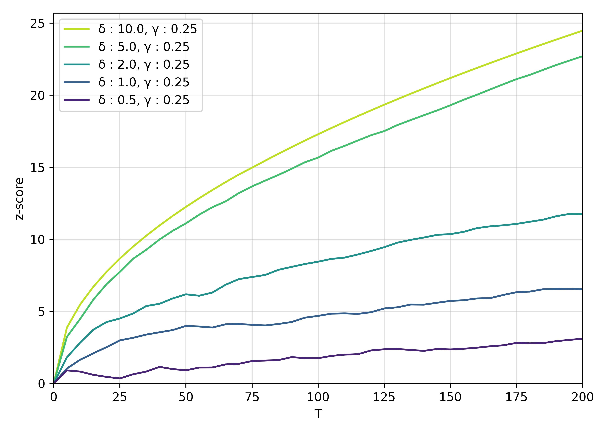
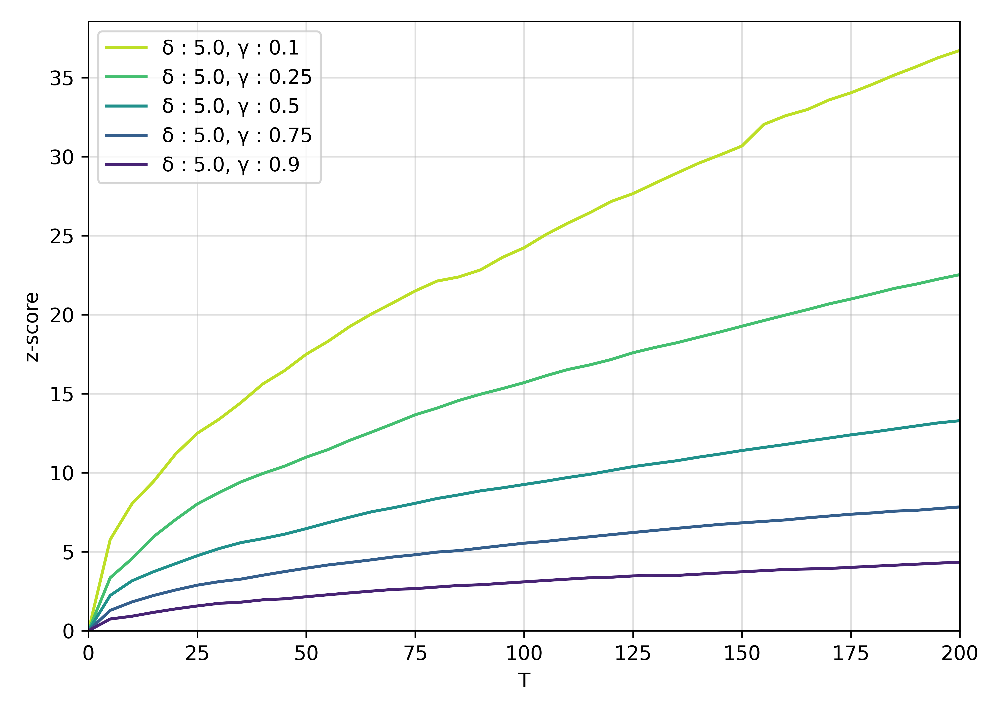
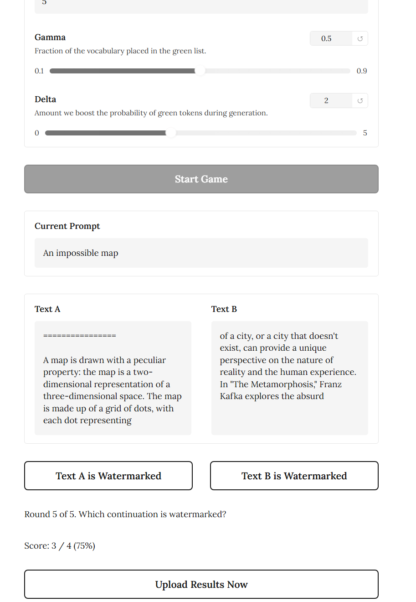
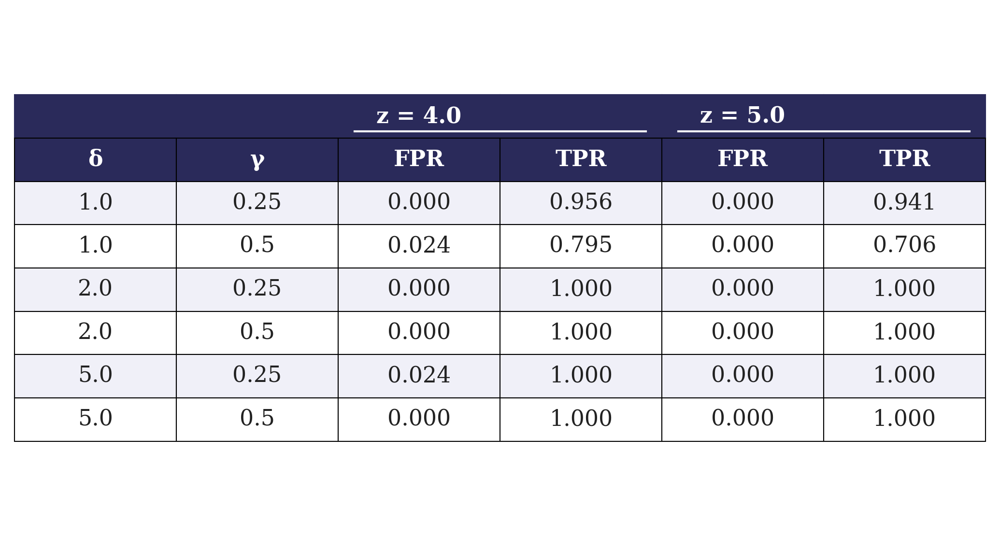

# Watermarking-LLMs

## INTRODUCTION

* * *

This repository is a CS 4782 final project that re-implements key ideas from *A Watermark for Large Language Models* by Kirchenbauer et al. The paper's main contribution is a token-level watermarking scheme that biases generation toward a pseudorandom "green list" of tokens while preserving fluency, then detects the watermark later using a statistical z-test.

This repo focuses on building the watermarking and detection pipeline from scratch, running controlled text generation experiments, and comparing the resulting detectability trends against the original paper.

## CHOSEN RESULT

* * *

The main result reproduced here is the paper's core claim that watermark detectability increases with generation length and with stronger watermark settings, while remaining measurable through a simple statistical detector. In this repo, that result is reflected by the `z_score_vs_T_varying_delta.png`, `z_score_vs_T_varying_gamma.png`, and `FINAL_tpr_fpr_table.png` artifacts inside `results/`.

The re-implementation is centered on the watermark detection statistic introduced in the paper's one-proportion z-test discussion, where larger z-scores provide stronger evidence that a sequence was generated with watermark knowledge rather than by an unwatermarked source.





## GITHUB CONTENTS

* * *

This project is organized around the main implementation, experiment artifacts, and submission materials:
- `code/` contains our code, but more specifically:
- `code/src/` contains the watermark implementation and analysis utilities.
- `code/scripts/` contains the main CLI entrypoint used to generate and score watermarked text.
- `code/app.py` provides a Gradio demo for an interactive watermark identification game.
- `data/` contains CSV outputs used to summarize and plot experiment behavior.
- `results/` contains generated figures comparing watermark strength, sequence length, and detection behavior.
- `poster/` contains the PDF used for the in-class project poster presentation.
- `report/` is reserved for the final project report PDF and is currently still pending.
- `requirements.txt` lists the core Python dependencies used in this repo.
- `LICENSE` specifies the license for this codebase.

## RE-IMPLEMENTATION DETAILS

* * *

The watermark is implemented in `src/watermarking_llms.py`. For each next-token step, the vocabulary is partitioned into a pseudorandom green list based on the previous token and a fixed hash key. During generation, green-list token logits are boosted by `delta`, and the fraction of green tokens in the final output is later scored with a z-test threshold detector.

The repo currently supports `gpt2` and a locally available `meta-llama/Llama-3.2-3B-Instruct` option in the demo app. The main generation defaults use sampling with `top_k=50`, `temperature=0.8`, `gamma=0.5`, and `delta=2.0`, which makes it easy to study how watermark strength changes as `gamma`, `delta`, and generated token count vary.

Compared with the original paper, this is a smaller-scale educational re-implementation rather than a full reproduction of every experiment in the OPT-family setting. The current code emphasizes the soft watermarking idea, the green-token detector, and interpretable plots of z-score and positive-rate behavior under different parameter settings.

## REPRODUCTION STEPS

* * *

The primary reproduction path in this repo is the CLI generation script, with the Gradio app as an optional interactive demo.

1. Clone the repository and create a Python environment.
2. Install the listed dependencies:

```bash
pip install -r requirements.txt
pip install datasets
```

3. Make sure the required Hugging Face model is available locally.
   The safest baseline path is `gpt2`. The Gradio app also references `meta-llama/Llama-3.2-3B-Instruct`, which must already be downloaded locally and may require Hugging Face access permissions.
4. Run a sample watermark generation from the command line:

```bash
python scripts/generate_with_model.py "The future of language models is"
```

5. Review the printed watermark analysis metrics, including generated tokens, perplexity, green fraction, z-score, p-value, and final watermark prediction.
6. For the optional interactive demo, run:

```bash
python app.py
```

The app launches a Gradio interface where users guess which of two continuations was watermarked. Aggregate game results are written to `results/game_results.csv` when uploaded from the interface.



This repo is intended to run on CPU for the `gpt2` path, but local GPU or Apple Silicon acceleration will improve speed. Reproduction fidelity is limited by available hardware, local model access, and the fact that larger-model paper settings are approximated here with smaller accessible models.

## RESULTS / INSIGHTS

* * *

The figures currently in `results/` show the same overall qualitative pattern reported by Kirchenbauer et al.: watermark evidence becomes stronger as more tokens are generated, and stronger watermark parameter choices tend to push z-scores upward more quickly.

`zscore_vs_T_varying_delta.png` and `zscore_vs_T_varying_gamma.png` visualize how detector confidence changes with sequence length `T` under different watermark settings. `FINAL_tpr_fpr_table_v2.png` summarizes the detection tradeoff more directly by comparing positive-rate behavior under thresholding. A user running this repo should expect to see measurable separation between watermarked and unwatermarked behavior, even though the exact numerical values may differ from the original paper because of model scale and experimental simplifications.



## CONCLUSION

* * *

This re-implementation shows that the main watermarking idea from Kirchenbauer et al. can be reproduced in a compact educational codebase: bias token generation toward a seeded green list, then recover statistically significant evidence of watermarking from the generated text alone. The main limitation is that this repo reproduces the core mechanism and trends rather than the paper's full large-scale experimental setup.

## REFERENCES

* * *

- Kirchenbauer, J., Geiping, J., Wen, Y., Katz, J., Miers, I., and Goldstein, T. *A Watermark for Large Language Models*. ICML 2023. https://proceedings.mlr.press/v202/kirchenbauer23a.html
- Hugging Face `transformers` library: https://github.com/huggingface/transformers
- PyTorch: https://pytorch.org/
- Gradio: https://www.gradio.app/

## ACKNOWLEDGEMENTS

* * *

This project was completed as part of CS 4782. Credits to John Kirchenbauer, Jonas Geiping, Yuxin Wen, Jonathan Katz, Ian Miers, and Tom Goldstein for the original watermarking paper that motivated this re-implementation. We also send a big thanks to our professors Kilian Weinberger and Wei-Chiu Ma for a great semester!

This repository reflects group work by Alex Joos, Zach Cheslock, and Andre as part of the course final project.
